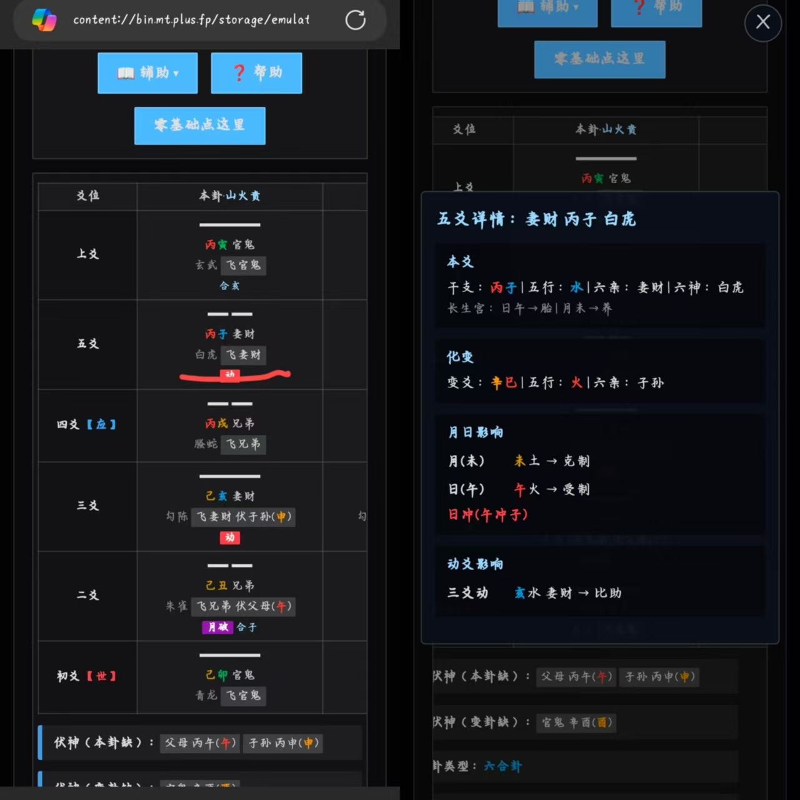
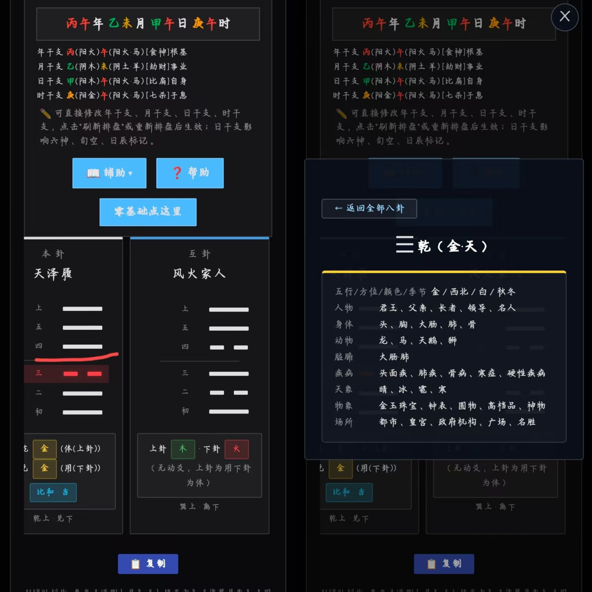

# 排盘 — 六爻 · 梅花易数

一个纯前端排盘工具，单文件 HTML，下载双击即可使用。**面向零基础用户**：不需要懂易经、八字，照着指引掷硬币或取三个数字，就能完成排盘。

## 功能

- **六爻排盘**：掷三次硬币 × 6 轮 → 输入 6 个数字 → 自动排出纳甲干支、六亲、六神、世应、旬空、飞伏神
- **梅花易数**：取三个正整数 → 自动生成本卦、互卦、变卦，含体用关系和卦气旺衰
- **万年历**：公历日期自动推算干支（年干支立春分界），支持手动修改
- **内置字典**：六十四卦卦辞爻辞、先后天八卦、京房八宫、天干地支、六亲六神、十二长生、节气、用神参考、五行生克
- **爻详情弹窗**：点击爻行查看化进化退、月日动影响、回头生克等详细分析
- **一键复制**：排盘结果整理为纯文本，粘贴给会卜算的朋友解读
- **暗色主题**：适配手机、平板移动端

## 快速开始

### 在线使用

访问 GitHub Pages：https://chuci013.github.io/paipan/

### 下载使用

1. 点击 [Releases](https://github.com/ChuCi013/paipan/releases/tag/v1.0) 下载 `EM_Calculator1.0.0.html`
2. 选中文件，打开方式，“用浏览器打开”。

## 使用指引

页面内点击 **「零基础点这里」** 按钮，有详细的入门教程：

- **六爻**：教你如何区分硬币正反面、什么结果对应什么数字、怎么依次填入 6 个空位
- **梅花**：教你如何取三个数字、哪个数对应上卦/下卦/动爻

## 截图

> 将截图文件放入仓库后，取消下面两行的注释即可显示。

  
 

更多截图见 [screenshots/](screenshots/) 目录。

## 参考资料

排盘逻辑参考《增删卜易》《卜筮正宗》等；梅花易数算法取自《梅花易数》等；六十四卦卦名、卦辞、爻辞参考《周易》（即《易经》）等。仅供学习娱乐。

## 免责声明

AI 辅助创作，仅供学习娱乐。相信科学，理性对待。当前仍为测试版本，排盘结果不构成任何预测或决策建议。

## 开源协议

本项目在 GitHub 完全开源免费，采用 MIT 协议。如遇付费版本均为盗版。

作者：[ChuCi013](https://github.com/ChuCi013)

## License

MIT
